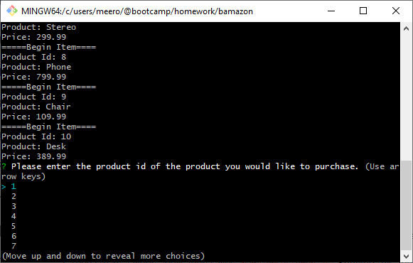
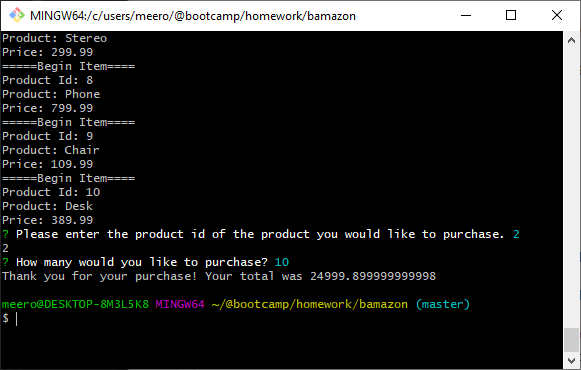
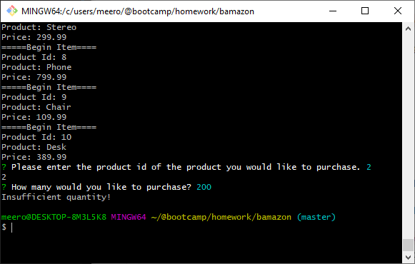

# bamazon
## bamazonCustomer.js
See list of items output to console and choose which item id you would like to purchase.

Once a product has been chosen, you will be asked how many you would like to buy

If there is enough stock to fulfill your order, then you will be presented with a total

If there is not enough stock to fulfill your order, then you will be presented with a message letting you know.

