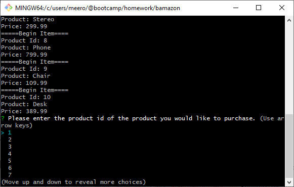
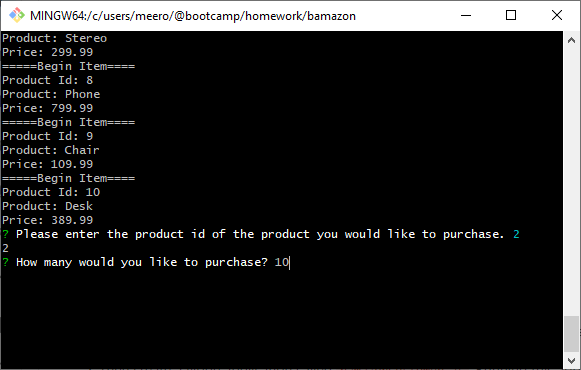
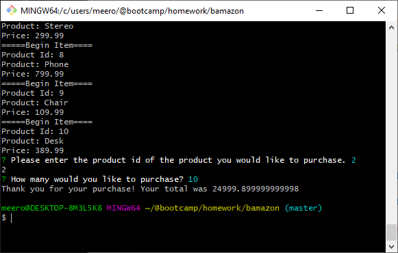
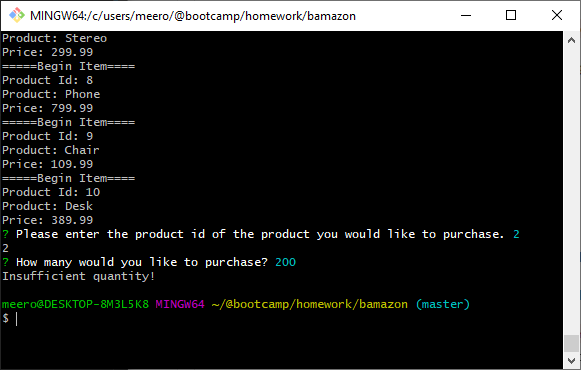
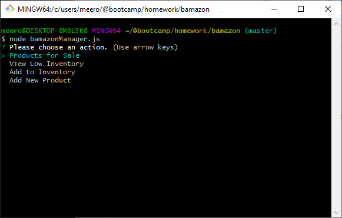
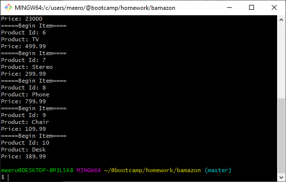
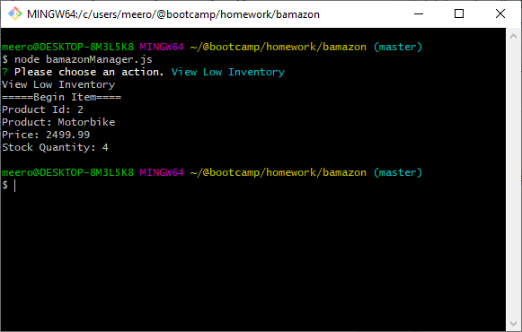
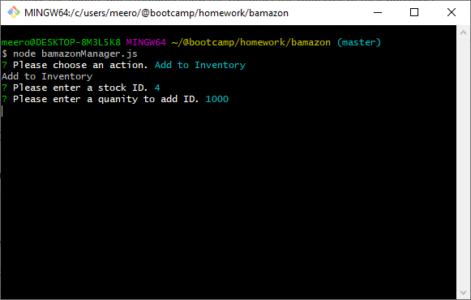

# bamazon
## bamazonCustomer.js
See list of items output to console and choose which item id you would like to purchase.

Once a product has been chosen, you will be asked how many you would like to buy

If there is enough stock to fulfill your order, then you will be presented with a total

If there is not enough stock to fulfill your order, then you will be presented with a message letting you know.

## bamazonManager.js
You will be presented with 4 options:

If Products for Sale is selected, you will be shown a list of all products

If View Low Inventory is selected, you will be shown a list of all products with low inventory levels (less than 5 units in stock)

If Add To Inventory is selected, you will be asked to enter a stock id, then a stock quantity to add to that inventory item
